# Core Workflows

mem8 is built around a memory-first development cycle that enhances Claude Code with persistent context and structured workflows.

## The Research → Plan → Implement → Commit Cycle

This is the primary workflow that mem8 enables. Each phase builds on the previous, creating a continuous loop of structured development.

```mermaid
graph LR
    A[🔍 Research] --> B[📋 Plan]
    B --> C[⚡ Implement]
    C --> D[✅ Commit]
    D --> E[🚀 PR]
    E -.Next Feature.-> A

    style A fill:#e1f5ff
    style B fill:#fff4e1
    style C fill:#e8f5e9
    style D fill:#f3e5f5
    style E fill:#fce4ec
```



### Why This Works

Each phase:
- **Stores context** in `thoughts/` for future reference
- **Uses sub-agents** to parallelize work
- **Builds on previous work** through file references
- **Creates artifacts** that Claude Code can read

## Phase 1: Research with `/research_codebase`

Deep codebase analysis using parallel sub-agents to understand architecture and patterns.

### How It Works


### What You Get

**Structured Research Document:**
```markdown
# Research: How Does Authentication Work?

## Summary
- Token-based JWT authentication
- Middleware validates on every request
- Redis stores active sessions

## Detailed Findings

### Authentication Flow (auth/middleware.py:45-67)
The middleware intercepts requests and validates JWT tokens...

[file references with line numbers]

## Architecture Insights
- Stateless JWT design allows horizontal scaling
- Refresh token rotation prevents token theft
- Rate limiting per user prevents abuse

## Code References
- `auth/middleware.py:45` - JWT validation
- `auth/tokens.py:23` - Token generation
- `auth/redis_store.py:12` - Session storage
```

### Key Features

- **Parallel sub-agents** explore different aspects simultaneously
- **Full file context** - reads mentioned files completely before spawning agents
- **Persistent memory** - research saved to `thoughts/shared/research/`
- **Git metadata** - captures commit, branch, researcher for context
- **File references** - clickable links to specific lines of code

## Phase 2: Plan with `/create_plan`

Design implementation with concrete steps based on research findings.

### Planning Process


### Plan Structure

```markdown
# Implementation Plan: Add OAuth2 Support

## Requirements
- [ ] Support GitHub OAuth2
- [ ] Support Google OAuth2
- [ ] Maintain existing JWT flow

## Technical Approach
Extend current JWT system with OAuth2 provider abstraction...

## Implementation Steps

### Phase 1: OAuth2 Provider Interface
- [ ] Create `auth/providers/base.py` with OAuth2Provider ABC
- [ ] Implement GitHub provider
- [ ] Add provider registry

### Phase 2: Integration
- [ ] Update middleware to support OAuth2 flow
- [ ] Add callback endpoint
- [ ] Store provider tokens

### Phase 3: Testing
- [ ] Unit tests for each provider
- [ ] Integration tests for OAuth2 flow
- [ ] Manual testing checklist

## Testing Strategy
...
```

### Plan Benefits

- **Executable roadmap** - checkboxes track progress
- **Reference for Claude** - next phase loads this plan
- **Team communication** - clear documentation of approach
- **Future reference** - understand why decisions were made

## Phase 3: Implement with `/implement_plan`

Execute the plan with full context, checking off steps as you go.

### Implementation Flow


### Key Behaviors

**Plan-Aware Implementation:**
- Reads plan and understands context
- Trusts completed checkboxes (resumable)
- Updates plan file as work progresses
- Asks for guidance when reality differs from plan

**Success Criteria:**
- Runs tests after each phase
- Fixes issues before proceeding
- Maintains forward momentum

## Phase 4: Commit with `/commit`

Create conventional commits based on session context.

### Commit Process


### Commit Guidelines

**mem8 follows best practices:**
- **Conventional commits** format (feat:, fix:, docs:, etc.)
- **Focused commits** - groups related changes
- **Clear messages** - explains why, not just what
- **User attribution** - commits are authored by you, not Claude
- **No AI mentions** - professional commit history

## Phase 5: PR with `/describe_pr`

Generate comprehensive PR descriptions from your work.

### PR Description Flow


### PR Documentation

**Comprehensive sections:**
- Problem statement
- Solution approach
- Technical details
- Breaking changes
- Migration guide
- Verification checklist (with automated checks!)
- Screenshots/examples

## Supporting Commands

### `/doctor` - Verify Tooling

Ensures your development environment is complete:

```mermaid
graph TD
    A[/doctor] --> B{Check git}
    B -->|Missing| C[Install instructions]
    B -->|OK| D{Check gh CLI}
    D -->|Missing| E[Install instructions]
    D -->|OK| F{Check thoughts/}
    F -->|Missing| G[Run mem8 init]
    F -->|OK| H{Check .claude/}
    H -->|Missing| I[Run mem8 init]
    H -->|OK| J[✅ All systems go]

    C --> K[--auto-fix option]
    E --> K
    G --> K
    I --> K
```

### `/browse-memories` - Search Context

Find relevant past research and decisions:

```mermaid
graph LR
    A[/browse-memories 'auth'] --> B[Search thoughts/]
    B --> C[List matching documents]
    C --> D[User selects]
    D --> E[Load document]
    E --> F[Use as context]

    style E fill:#e1f5ff
    style F fill:#c8e6c9
```

### `/setup-memory` - Initialize

Sets up mem8 with multi-repo discovery:

```mermaid
graph TD
    A[/setup-memory] --> B{Single repo?}
    B -->|Yes| C[Single-repo mode]
    B -->|No| D[Ask for repo list]
    D --> E[Multi-repo mode]
    C --> F[Run mem8 init]
    E --> F
    F --> G[Configure thoughts sync]
    G --> H[✅ Memory enabled]
```

## Advanced Workflows

### Team Collaboration


### Context Accumulation

Each phase builds on previous work:


### Multi-Feature Development

```mermaid
gantt
    title Parallel Feature Development with mem8
    dateFormat HH:mm
    section Feature A
    Research      :a1, 00:00, 30m
    Plan         :a2, after a1, 20m
    Implement    :a3, after a2, 2h
    section Feature B
    Research     :b1, 00:15, 30m
    Plan        :b2, after b1, 20m
    Implement   :b3, after b2, 2h
    section Integration
    Test        :c1, after a3 b3, 30m
    PR          :c2, after c1, 15m
```



## Context Engineering Architecture

mem8 implements [Anthropic's context engineering principles](https://www.anthropic.com/engineering/effective-context-engineering-for-ai-agents) to maximize Claude's effectiveness while minimizing context usage.

### The Context Economy

```mermaid
graph TD
    A[Finite Context Window] --> B{Context Strategy}
    B -->|❌ Naive| C[Load Everything]
    C --> D[Context Overflow]
    C --> E[Slow Performance]
    C --> F[Loss of Focus]

    B -->|✅ mem8| G[Just-in-Time Context]
    G --> H[Parallel Sub-Agents]
    G --> I[Structured Notes]
    G --> J[Persistent Memory]

    H --> K[Efficient Exploration]
    I --> L[Compact References]
    J --> M[Build on Past Work]

    K --> N[High-Signal Results]
    L --> N
    M --> N

    style A fill:#ffebee
    style G fill:#e8f5e9
    style N fill:#c8e6c9
```



### mem8's Context Engineering Approach

#### 1. Sub-Agent Architecture

Instead of loading entire codebases into context, mem8 spawns specialized sub-agents:


**Key Benefits:**
- **Parallel Exploration** - Multiple agents search simultaneously
- **Context Isolation** - Each agent has focused context
- **Result Compaction** - Only high-signal findings returned
- **Scalable** - Works on codebases of any size

#### 2. Structured Note-Taking

mem8 creates persistent, structured documents that serve as lightweight context:


**vs Loading Full Files:**
- **Research doc** (~2KB) vs **Full codebase** (~500KB+)
- **Plan doc** (~5KB) vs **Re-analyzing everything** (~1MB+)
- **File reference** (`auth.py:45`) vs **Full file content** (~10KB)

#### 3. Just-in-Time Context Retrieval

Context loaded only when needed:

```mermaid
sequenceDiagram
    participant C as Claude
    participant M as mem8 Memory
    participant FS as Filesystem

    Note over C: Starting implementation
    C->>M: Do we have research on auth?
    M->>C: Yes: thoughts/shared/research/auth.md
    C->>FS: Load research doc (2KB)

    Note over C: Need code details
    C->>C: Research mentions auth.py:45
    C->>FS: Read auth.py lines 40-60 (0.5KB)

    Note over C: vs Naive Approach
    Note over C: ❌ Load entire codebase (500KB+)
    Note over C: ❌ All past research (100KB+)
    Note over C: ❌ Context overflow!
```



#### 4. Compaction Through Synthesis


### Anthropic's Principles → mem8 Implementation

| Principle | mem8 Implementation |
|-----------|---------------------|
| **Minimal Context** | File references (`file:line`) not full files |
| **Just-in-Time** | Load research docs only when relevant |
| **Sub-Agents** | Parallel exploration with `codebase-locator`, etc. |
| **Structured Notes** | Research → Plan → Implement documents |
| **Compaction** | Synthesize sub-agent findings into concise docs |
| **Autonomous Navigation** | Agents explore codebase independently |
| **Lightweight References** | Links to thoughts, not full content |

### Context Budget Example

**Feature: Add OAuth2 Support**


**Context Savings:**
- **Without mem8:** ~2M tokens (reload codebase each time)
- **With mem8:** ~200K tokens (use persistent documents)
- **10x reduction** in context usage

## Why Memory-First Development Works

### Context Preservation


### Compounding Knowledge

Each cycle adds to your project's knowledge base:

1. **First Feature:** Research from scratch → plan → implement
2. **Second Feature:** Browse past research → faster planning → reuse patterns
3. **Third Feature:** Rich context → precise plans → confident implementation
4. **Nth Feature:** Comprehensive memory → minimal research → rapid delivery

## Best Practices

### Start Every Feature with Research

```bash
# Don't just jump in
❌ /create_plan "add feature"

# Understand first
✅ /research_codebase "how do similar features work?"
✅ /browse-memories "past features like this"
✅ /create_plan "add feature based on patterns"
```

### Keep Plans Updated

```bash
# As you implement
- [x] Phase 1: Complete
- [ ] Phase 2: In progress  # Update checkboxes!
- [ ] Phase 3: Not started
```

### Document Decisions

```bash
# When you make a choice
# Add to plan or research document:
## Decision: Chose X over Y
Rationale: Performance tests showed...
Trade-offs: More complexity but 10x faster
```

### Use Doctor Regularly

```bash
# Before starting work
mem8 doctor

# Catches issues early
✅ git: installed
✅ gh: authenticated
✅ thoughts/: synced
⚠️  .claude/agents/: 2 deprecated agents found
```

## Next Steps

- **[Commands Reference](./commands)** - Full command documentation
- **[User Guide](./user-guide/getting-started)** - Practical examples
- **[External Templates](./external-templates)** - Customize workflows
- **[GitHub](https://github.com/killerapp/mem8)** - Explore source

## Real-World Example

```mermaid
timeline
    title Adding OAuth2 Support (Real Timeline)
    section Day 1
      09:00 : /research_codebase "current auth system"
      09:45 : /create_plan "add OAuth2"
      10:00 : User review
      10:15 : /implement_plan (Phase 1)
    section Day 2
      09:00 : Continue Phase 2
      11:00 : Phase 2 tests passing
      11:30 : /implement_plan (Phase 3)
      14:00 : All phases complete
      14:30 : /commit
    section Day 3
      09:00 : /describe_pr
      09:30 : PR submitted
      10:00 : Team review using thoughts/
```

**Result:**
- 3 days from idea to PR
- Fully documented in thoughts/
- Team can understand all decisions
- Next OAuth2 provider takes 1 day (memory!)
